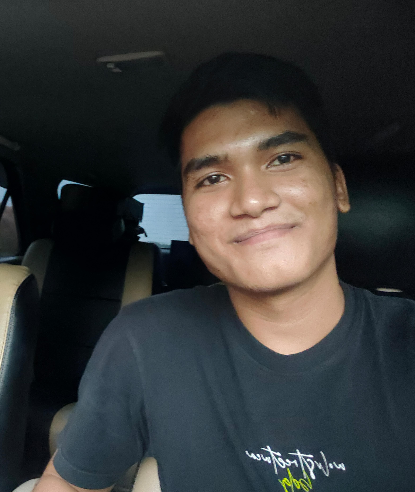

<html lang="id">
<head>
    <meta charset="UTF-8">
    <meta name="viewport" content="width=device-width, initial-scale=1.0">
    <title>Profil Saya</title>
    
</head>
<body>

<header>
    <h1>Selamat Datang di Halaman Profil Saya</h1>
</header>

    

         
        

            <h1>Jogi Purba</h1>
            <h1>Cita-cita:TNI/POLRI</h1>
            <h1>Impian:Programmer</h1>
        

    

    

        <h2>Hobby saya</h2>
        
1.Olahraga

        
2.Ngoding
   
        
3.Motoran
   
        
4.Membaca Novel

    

        <h2>Tentang Saya</h2>
        
Saya lahir dan besar di Huta Bayu, Saya anak ke 3 dari 4 bersaudara. Saya sebernarnya memiliki cita-cita sebagai tentara akan tetapi cita-cita saya belum dapat saya raih sekarang oleh sebab itu saya memulai dari awal lagi di perkuliahan agar dapat masuk tentara melalui PA PK. Jikalaupun saya tidak dapat meraih cita-cita saya nantinya saya tidak terlalu sedih dikarenakan saya masih dapat berkarir di bidang yang saya minati yaitu sebagai programmer, saya menyukai dunia perkodingan semennjak saya sd disaat saya melihat dan belajar mengenai hacker akan tetapi saya belum paham pemrograman saat itu. Saya mulai belajar pemrograman disaat saya memasuki SMA disana saya mulai belajar codingan disaat pembelajaran TIK, saya sangat tertarik dengan kodingan karena dari kecil saya sangat ingin belajar mengenai kodingan. Mimpi yang saya inginkan yaitu menjadi seorang programmer handar dan dapat menjadi seorang white hycker yang meretas situs gelap lalu menyebarkannya kepada pihak berwajib dan juga saya ingin memberantas korupsi dengan cara mencari bukti dan menyebarkannya agar semua rakyat tau dan juga agar hukum dapat di tegakkan. Saya sebernarnnya sangat tertarik dengan perkuliahan di itb, akan tetapi saya tidak dapat masuk kesana dikarenakan orang tua saya tidak menginginkan saya jauh-jauh bersekolah agar dapat mengunjungi mereka sesekali. Saya juga sadar akan hal itu dikarenakan saya adalah anak laki-laki terakhir di keluarga saya dan saya sadar akan kewajiban saya untuk menjaga orang tua saya. Oleh karena itu saya sangat ingin lulus dengan nilai yang bagus dari perkuliahan agar dapat bekerja di perusahaan maupun bekerja dari rumah dengan cara bekerja sama dengan sebuah perusahaan. Saya juga berniat melanjutkan pendidikan saya sampai S2 dikarenakan saya juga ingin dapat lebih dalam memahami mengenai kodingan dan saya juga ingin mendapatkan gelar M.kom.

    

    

        <h2>Permasalahan Hidup</h2>
        
Saya sempat keluar dari unimed pada akhir semester 1 dikarenakan mengikuti diklat di rindam selama 4 bulan karena perintah dari orang tua saya, saya masuk ke rindam di bulan desember dan saya keluar dari rindam di pertengahan bulan april. Oleh karena itu nilai saya di perkuliahan menjadi rusak karena tidak uas 2 mata kuliah di semester 1 dan tidak berkuliah di semester 2. saya baru mulai masuk kuliah lagi di semester 3 ini dikarenakan sudah  malas mengikuti tes tentara(AKMIL) karena persaingan yang sangat kotor. Saya ingin fokus kuliah untuk mencapai impian saya dan untuk menjadikan impian saya menjadi sebuah kenyataan.

    

    

    

    <footer>
        
&copy; 2024 Profil Pribadi. All rights reserved.

    </footer>

